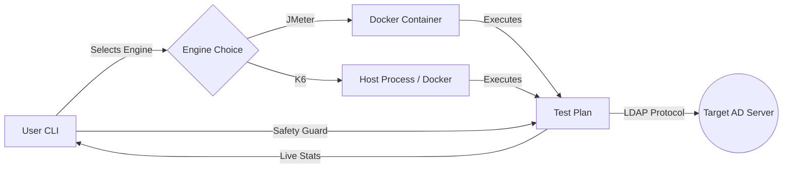

# TECHTON ⚡
> **Enterprise Active Directory Stress Testing & Load Analysis Suite**


**Techton** is a battle-hardened DevOps CLI tool designed to audit the resilience of **Active Directory (AD)** infrastructure. It simulates massive "Boot Storms", complex Directory Queries, and advanced attack vectors to identify bottlenecks in CPU, RAM, and Network limits.

Techton encapsulates the power of two industry-leading engines: **Apache JMeter** (Standard) and **K6** (High Performance), orchestrated by an intelligent **Bash TUI**.

---

## 🧠 Enterprise Methodology: The Science of Resilience

Techton goes beyond simple "hammering". It uses advanced traffic modeling to simulate realistic human behavior and protect your infrastructure during testing.

### 1. 🚦 Traffic Profiles (Realism Engine)
*   **Linear Ramp:** Gradual increase, mimicking normal office start hours.
*   **Spike Attack:** Sudden burst of massive traffic to test system shock resistance.
*   **Poisson Arrival:** **(Most Realistic)** Uses statistical distribution for random user arrivals, ensuring no two users hit the server at the exact same millisecond.

### 2. 🛡️ Auto-Abort Safety Guard
Testing shouldn't break your production. Techton includes an intelligent fail-safe:
*   **Latency Threshold:** Automatically kills the attack if 95% of requests exceed your defined limit (e.g., >5000ms).
*   **Error Rate Guard:** Stops execution if the error rate exceeds 80%, preventing server-side resource exhaustion.

### 3. 🧪 Advanced Attack Vectors
Techton 1.1 introduces specialized stress modes:
*   **Authentication Storm:** Focuses on **CPU** (Hashing/Encryption).
*   **Directory Search:** Focuses on **RAM/IO** (Database caching).
*   **Recursive Membership:** Deep-dives into nested groups (CPU Intensive).
*   **Titan Stress (Hybrid):** Combines recursion with large binary attribute retrieval (ThumbnailPhoto, Certificates) for maximum CPU/RAM pressure.
*   **Password Spray:** Simulates brute-force logic and lockout processing.
*   **DNS Flood:** Stress tests the AD-integrated DNS service.

---

## ⚙️ Architecture



---

## 🚀 Installation

### Prerequisites
*   **Linux Server** (Ubuntu, Debian, CentOS, Kali, etc.)
*   **Docker** (Required for JMeter and Dockerized K6)
*   **Hardware:** Recommended 4+ Cores, 8GB+ RAM for simulating >5,000 users.

### Quick Install
Clone and run the installer:

```bash
git clone https://github.com/ddt-mmt/Techton.git
cd Techton
sudo ./install.sh
```

---

## 📖 User Guide

### 1. Initialize Attack
Run `techton` and follow the wizard:
1.  **Select Environment:** Docker (Isolated) or Host (Direct).
2.  **Select Engine:** K6 is recommended for Advanced Modes.
3.  **Choose Mode:** Select from Basic (Login/Search) or **Advanced Attack Vectors**.
4.  **Target Configuration:** Enter IP and **Base DN** (e.g., `OU=Users,DC=corp,DC=local`).
5.  **Traffic & Safety:** Choose your Traffic Profile and set your Latency Threshold.

### 2. Credential Validation
Techton performs a **Fail-Fast** check. It will verify your credentials with a single-user bind before launching the massive load, saving you time from misconfigurations.

### 3. Live Dashboard
Monitor the attack with the real-time HUD showing Active VUs, Throughput, and Latency against your Safety Guard limits.

---

## 📂 History & Retention

*   **Auto-Logging:** Every test is saved in `results/`.
*   **Retention Policy:** Automatically deletes logs older than **30 Days**.
*   **Viewer:** Use menu `[2]` to browse past tests with detailed statistical analysis (Avg/Max Latency, Error Rates).

---

## ⚠️ Disclaimer

**AUTHORIZED USE ONLY.**
This tool is a powerful load generator capable of causing Denial of Service. Use only in Lab/Staging environments. The authors are not responsible for damage caused by misuse.

## 📄 License

Distributed under the MIT License. See `LICENSE` for more information.
