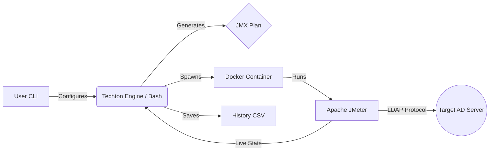

# TECHTON ⚡
> **Enterprise Active Directory Stress Testing & Load Analysis Tool**


**Techton** is a specialized DevOps tool designed to audit the resilience of **Active Directory (AD)** infrastructure. Unlike generic load testers, Techton is specifically tuned for LDAP authentication workflows, allowing System Administrators to simulate "Boot Storms" (mass login events) safely and accurately.

It wraps the power of **Apache JMeter** inside a lightweight **Docker** container, orchestrated by an intelligent **Bash CLI** that acts as both a controller and an analyst.

---

## 🧠 Methodology: The Science Behind Techton

Techton doesn't just "spam" the server. It follows a strict testing methodology to ensure valid results without triggering false-positive security alerts.

### 1. Smart Ramp-Up (Anti-DDoS Logic)
Sending 1,000 login requests in 1 second isn't a load test; it's a DoS attack. Firewalls will block it immediately.
*   **Techton's Formula:** `RampUp Time = Threads / 5`
*   **Concept:** It injects users gradually (5 users/sec).
*   **Benefit:** This mimics real human behavior (employees arriving at the office) and ensures you test the *AD Server's capacity*, not your Firewall's blocking speed.

### 2. Time-Based Sustained Load
Techton focuses on **Duration**, not Loop Count.
*   It forces a "Steady State" load (e.g., maintaining 500 concurrent users for 5 minutes).
*   This exposes **Memory Leaks** and **CPU Thermal Throttling** issues that short burst tests miss.

### 3. The "Doctor" Analysis (Heuristic Diagnostics)
At the end of a test, Techton analyzes the statistical data to pinpoint the *Root Cause* of performance issues:

| Symptom | Metric Threshold | Probable Root Cause |
| :--- | :--- | :--- |
| **Healthy** | Latency < 500ms | System is optimal. |
| **Warning** | Latency 500ms - 2s | System is nearing capacity. Optimization needed. |
| **Critical** | Latency > 2s | **CPU Bottleneck.** The server cannot encrypt/hash passwords fast enough. |
| **Failure** | Error Count > 0 | **Network/Configuration Limit.** Max Connections reached or Firewall dropping packets. |

---

## ⚙️ How It Works

Techton operates on a "Headless Architecture" to maximize performance.



1.  **Input:** User provides Target IP, Credentials, and Load (Users).
2.  **Generation:** Techton generates a dynamic JMeter Test Plan (`.jmx`) with calculated Ramp-up/Duration.
3.  **Isolation:** A Docker container (`justb4/jmeter`) is spun up to execute the attack. This ensures the tool runs identically on any Linux machine.
4.  **Live Stream:** JMeter output is piped to `awk` for real-time dashboard rendering.
5.  **Sanitization:** A "Kill Switch" ensures the `.jmx` file (containing the password) is shredded immediately after execution.

---

## 🚀 Installation

### Prerequisites
*   **Docker** (Must be installed and running)
*   **Linux/Mac** (Bash shell)

### Quick Install
```bash
git clone https://github.com/ddt-mmt/Techton.git
cd Techton
sudo ./install.sh
```

Now you can run the command `techton` from anywhere.

---

## 📖 Usage Guide

Run the tool:
```bash
techton
```

### Modes
1.  **Start New Stress Test:**
    *   **Target IP:** Your Domain Controller IP.
    *   **User DN:** Distinguished Name of a standard user (e.g., `CN=test,OU=Users,DC=corp,DC=local`).
    *   **Threads:** Number of concurrent users to simulate.
2.  **View History Log:**
    *   View past test results, status, and paths to full HTML reports.

---

## ⚠️ Disclaimer

**AUTHORIZED USE ONLY.**
This tool is a powerful load generator. Using it against servers you do not own or do not have explicit permission to test is a crime under the Computer Fraud and Abuse Act (CFAA) and similar laws globally.

## 📄 License

Distributed under the MIT License. See `LICENSE` for more information.