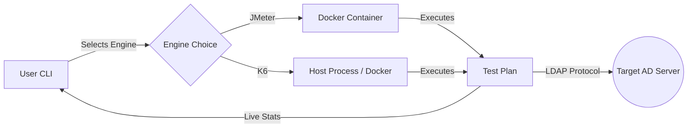

# TECHTON ⚡
> **Enterprise Active Directory Stress Testing & Load Analysis Suite**


**Techton** is a battle-hardened DevOps CLI tool designed to audit the resilience of **Active Directory (AD)** infrastructure. It simulates massive "Boot Storms" and Directory Queries to identify bottlenecks in CPU, RAM, and Network limits before they impact production.

Techton encapsulates the power of two industry-leading engines: **Apache JMeter** (Standard) and **K6** (High Performance), orchestrated by an intelligent **Bash TUI**.

---

## 🧠 Methodology: The Science Behind Techton

Techton follows a strict engineering approach to Load Testing, ensuring results are valid and actionable.

### 1. The "Smart Ramp-Up" (Anti-DDoS Logic)
Sending 20,000 requests in 1 second isn't a test; it's a DoS attack.
*   **Formula:** `RampUp Time = Threads / 5`
*   **Mechanism:** Techton injects users gradually (5 users/sec).
*   **Benefit:** Mimics real-world employee behavior (morning arrival) and prevents Firewall false-positives.

### 2. Dual-Engine Hybrid Architecture
*   **Apache JMeter (Docker):** The industry standard. Best for complex, protocol-heavy tests. Runs isolated in Docker for safety.
*   **K6 (Host/Local):** The modern, high-performance challenger written in Go. Best for raw throughput and massive concurrency with lower resource overhead. **Includes custom LDAP build.**

### 3. Attack Modes
*   **Mode 1: Authentication Storm (LDAP Bind)**
    *   *Stress Target:* **CPU** (Encryption/Hashing).
    *   *Scenario:* 8:00 AM Login Rush.
*   **Mode 2: Directory Search (LDAP Query)**
    *   *Stress Target:* **RAM & Disk I/O** (Database `ntds.dit` caching).
    *   *Scenario:* Outlook Address Book lookups, HR App Sync.

---

## ⚙️ Architecture



---

## 🚀 Installation

### Prerequisites
*   **Linux Server** (Ubuntu, Debian, CentOS, Kali, etc.)
*   **Docker** (Required for JMeter mode)
*   **Hardware:** Recommended 4+ Cores, 8GB+ RAM for simulating >5,000 users.

### Quick Install
Clone and run the installer (installs to `/opt/techton`):

```bash
git clone https://github.com/ddt-mmt/Techton.git
cd Techton
sudo ./install.sh
```

Now you can run the command `techton` from anywhere.

---

## 📖 User Guide

Run the tool:
```bash
techton
```

### 1. Initialize Attack
Follow the interactive wizard:
*   **Select Environment:** Docker (Isolated) or Host (Direct Network).
*   **Select Engine:** JMeter or K6.
*   **Target IP:** IP of your Domain Controller.
*   **User DN:** DN of a standard user (e.g., `CN=test,OU=Users,DC=corp,DC=local`).
*   **Threads & Duration:** Define your load intensity.

### 2. Live Dashboard
Monitor the attack in real-time with the Cyberpunk HUD:
*   **Throughput:** Logins per second.
*   **Latency:** Average response time.
*   **Errors:** Connection timeouts or refusals.

### 3. Kill Switch
Press `Ctrl+C` at any time to execute an **Emergency Stop**. Techton will immediately kill any active containers or processes.

---

## 📂 History & Retention

*   **Auto-Logging:** Every test is saved in `/opt/techton/results/`.
*   **Retention Policy:** Techton automatically deletes logs older than **30 Days** to save disk space.
*   **Viewer:** Use menu `[2]` to browse past tests and view their status (PASS/FAIL).

---

## ⚠️ Disclaimer

**AUTHORIZED USE ONLY.**
This tool is a powerful load generator capable of causing Denial of Service. Using it against servers you do not own or do not have explicit permission to test is illegal. The authors are not responsible for damage caused by misuse.

## 📄 License

Distributed under the MIT License. See `LICENSE` for more information.